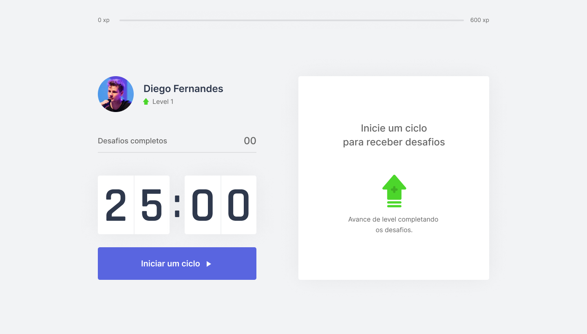
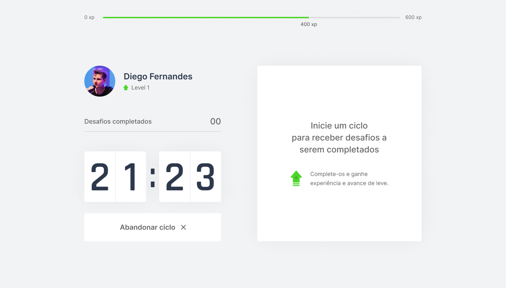
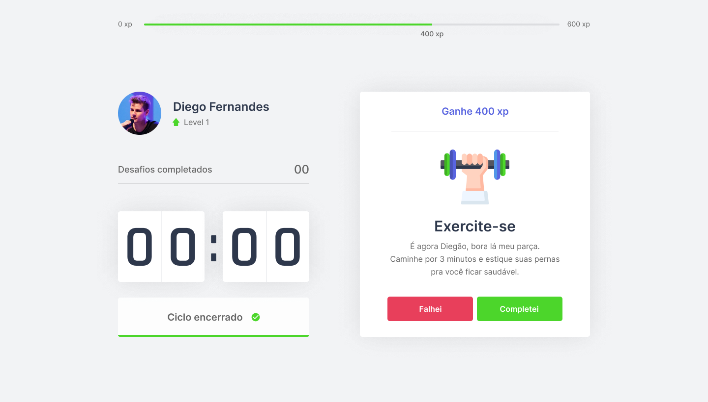
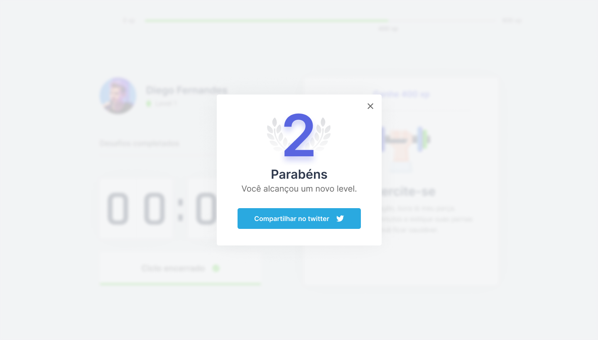

<p align="center">
   
</p>

<p align="center">	
   <a href="https://www.linkedin.com/in/gmorae/">
      
   </a>
  

  <a href="https://github.com/gmorae/move.on/commits/master">
    
  </a>
</p>

<div align="center">
  <sub>The NLW 4 project. Built with ❤︎ by
    <a href="https://github.com/gmorae">Gabriel Moraes</a> and
    <a href="https://github.com/gmorae/move.on/graphs/contributors">
      contributors
    </a>
  </sub>
</div>

# :pushpin: Table of Contents

* [Technologies](#computer-technologies)
* [Features](#rocket-features)
* [How to Run](#construction_worker-how-to-run)
* [Author](#author)
* [License](#license)

### Web Screenshot
<div>
   
   
   
      
</div>

# :computer: Technologies
This project was made using the following technologies:

* [Next](https://nextjs.org/)      
* [Next with typescript](https://nextjs.org/docs/basic-features/typescript)      
* [Styled Components](https://styled-components.com/)       

# :rocket: Features

# :construction_worker: How to run
```bash
# Clone Repository
$ git clone https://github.com/gmorae/move.on.git

# Go to server folder
$ cd move.on

# Install Dependencies
$ yarn

# Run Aplication
$ yarn start
```

Go to http://localhost:3000/ to see the result.

<h2 id="author"> 💻 Author </h2>


By Ana Torres 👋🏽 Find me:

[](https://www.linkedin.com/in/anabrtorres/)
[](mailto:anabrtorres19@gmail.com)

<h2 id="license"> 📝 License </h2>

This project is under the MIT license.
